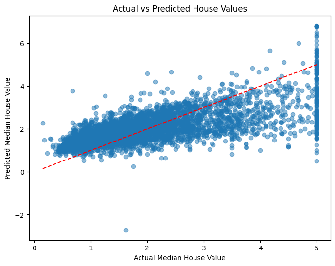

# Project 01: California Housing Price Prediction  
**Author**: Kiruthikaa Natarajan Srinivasan  
**Date**: October 15, 2025  

# Project 01 — California Housing Price Prediction

This project demonstrates a simple **Linear Regression** model using the **California Housing dataset** from `scikit-learn`.  
The analysis explores the dataset, performs visualizations, selects key features, trains a model, and evaluates its performance.

## Files

- `ml01.py` — Python script containing the full workflow.
- `README.md` — Overview of the project.
- `docs/index.md` — Documentation homepage for MkDocs or static hosting.

## Project Overview

### Objective
Predict median house values (`MedHouseVal`) in California based on housing and demographic features.

### Dataset
- Source: `sklearn.datasets.fetch_california_housing`
- Samples: ~20,640
- Features: 8 numeric features (e.g., Median Income, Average Rooms, Latitude, Longitude, etc.)
- Target: Median house value (`MedHouseVal`)

---

## Workflow Summary

1. **Import and Inspect Data**
   - Load the dataset from Scikit-Learn.
   - Combine features and target into a DataFrame for exploration.
   - Examine datatypes, missing values, and summary statistics.

2. **Explore and Visualize**
   - Plot histograms of each numeric column.
   - Optionally use `sns.boxenplot` and `sns.pairplot` for detailed relationships.

3. **Feature Selection**
   - Selected key predictors: `MedInc` (Median Income) and `AveRooms` (Average Rooms).

4. **Modeling**
   - Train a Linear Regression model using `train_test_split` (80/20).
   - Evaluate using:
     - R² (Coefficient of Determination)
     - MAE (Mean Absolute Error)
     - RMSE (Root Mean Squared Error)

5. **Results (Sample Output)**
